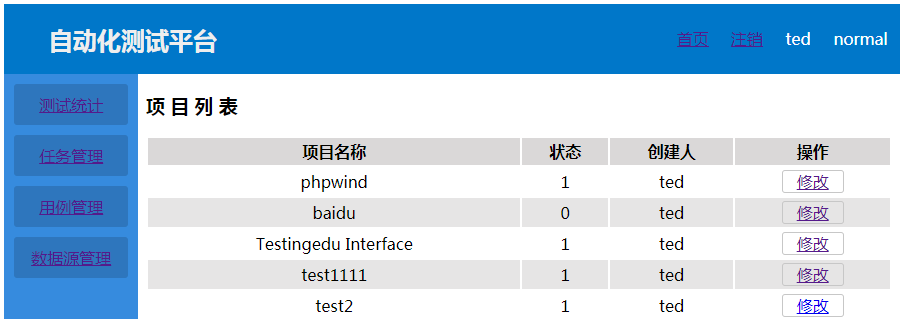
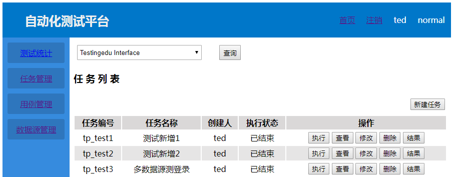
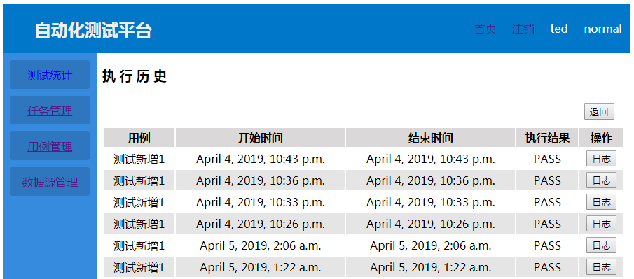
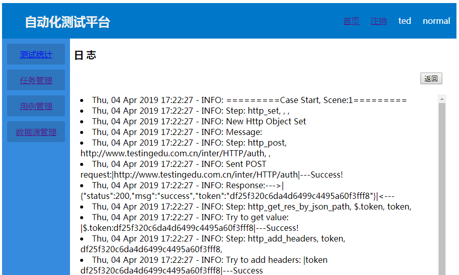
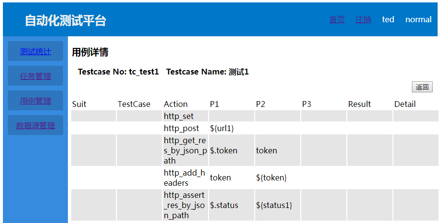
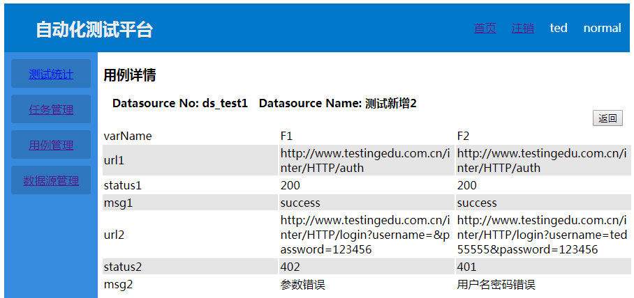

# WebDemo

#### Web Plateform of Autotest

*(Not completed yet...)*

----

| Python | Django | Requests | Selenium

----

#### *Comment*

>It's complex and inefficiency to handle For statement and If-elseif-else statement of 
>test cases written with Excel.

>Probably develop TestCore module base on Robot Framework is a better solution.

---

#### Feature

HTTP API Autotest

Web Test Autotest

----

#### Module

Login:  *login and logout*

Projects:  *projects management*

Testplan:  *organize test run and report*

Testcase:  *import and modify testcase*

Datasourse: *import datasource of testcase*

TestCore:  *main module of running test*

----

#### Projects

#### Testplan

#### Testcase

#### Datasource

